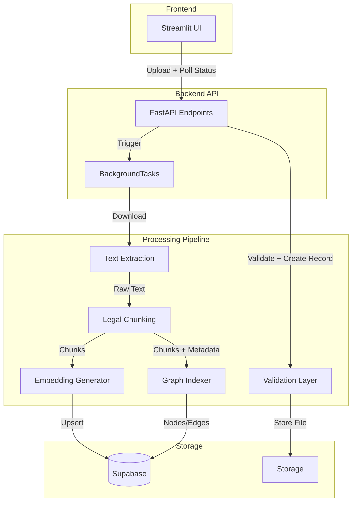
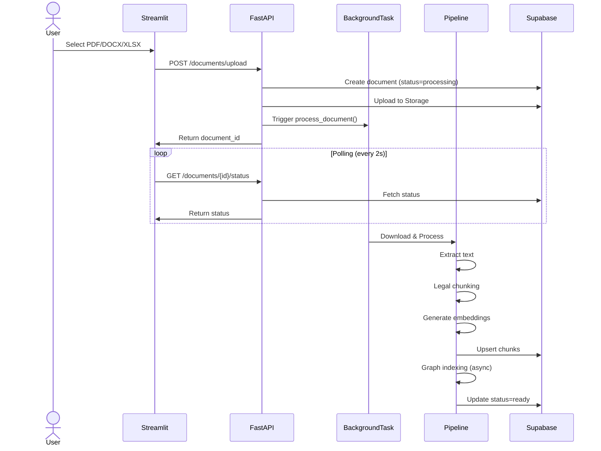

# Document Ingestion Design

**Spec**: `.specs/features/document-ingestion/spec.md`  
**Status**: Draft  
**Phase**: Phase 2 (follows Supabase Schema Phase 1)

---

## Architecture Overview

### System Context

The Document Ingestion feature is a multi-stage pipeline that transforms uploaded legal documents (PDF/DOCX/XLSX) into queryable knowledge for the RAG agent. It supports two indexing tracks:

1. **Vector RAG (MVP)**: Text extraction → chunking → embeddings → Supabase pgvector
2. **Graph RAG (v1)**: Entity/relation extraction → graph storage → evidence linking

### High-Level Architecture



### Data Flow



---

## Code Reuse Analysis

### Existing Components to Leverage

| Component | Location | How to Use |
|-----------|----------|------------|
| `PyPDFLoader` | `document_loaders/pdf_loader.py` | Extend to add metadata extraction |
| `Settings` | `my_agent/config/settings.py` | Add ingestion-specific settings |
| `Registry Pattern` | `my_agent/registry.py` | Add ingestion service accessors |
| `Base Retriever` | `my_agent/retrievers/base.py` | Pattern for extraction service base class |

### Integration Points

| System | Integration Method |
|--------|---------------------|
| **Supabase Storage** | `supabase.storage.from_('documents').upload()` |
| **Supabase DB** | SQLAlchemy + psycopg2 with pgvector extension |
| **OpenAI Embeddings** | `langchain-openai.OpenAIEmbeddings` |
| **LangChain Loaders** | `PyPDFLoader`, `Docx2txtLoader` |

### New Components Required

| Component | Purpose |
|-----------|---------|
| `DocumentProcessor` | Orchestrates the pipeline stages |
| `LegalChunker` | Structure-preserving chunking for legal docs |
| `XLSXMetadataExtractor` | Extract sheet/column metadata |
| `GraphExtractor` | Entity/relation extraction for Graph RAG |
| `IngestionAPI` | FastAPI endpoints for upload/status |

---

## Components

### 1. Ingestion API Layer

**Purpose**: FastAPI endpoints for document upload and status polling

**Location**: `api/routes/documents.py`

**Interfaces**:

```python
@router.post("/documents/upload")
async def upload_document(
    file: UploadFile,
    user_id: str = Depends(get_current_user_id),
) -> UploadResponse:
    """
    Validates file, creates document record, uploads to storage,
    triggers background processing.
    """

@router.get("/documents/{document_id}/status")
async def get_document_status(
    document_id: str,
    user_id: str = Depends(get_current_user_id),
) -> StatusResponse:
    """
    Returns current processing status with timing info.
    """

@router.get("/documents")
async def list_documents(
    user_id: str = Depends(get_current_user_id),
    status: Optional[str] = None,
) -> List[DocumentSummary]:
    """
    Lists user's documents with optional status filter.
    """
```

**Dependencies**: FastAPI, Supabase client, BackgroundTasks

**Reuses**: Settings pattern from `my_agent/config/settings.py`

---

### 2. Document Processor (Pipeline Orchestrator)

**Purpose**: Coordinates the ingestion pipeline with idempotent stages

**Location**: `services/document_processor.py`

**Interfaces**:

```python
class DocumentProcessor:
    def __init__(
        self,
        storage_client: SupabaseStorage,
        db_client: SupabaseDB,
        embedding_client: OpenAIEmbeddings,
        graph_extractor: Optional[GraphExtractor] = None,
    ):
        ...

    async def process(self, document_id: str, user_id: str) -> None:
        """
        Main entry point. Downloads file, routes to appropriate
        processor based on file type, updates status at each stage.
        """

    async def _process_pdf_docx(
        self, doc: DocumentRecord, file_path: str
    ) -> None:
        """PDF/DOCX: extract → chunk → embed → graph"""

    async def _process_xlsx(
        self, doc: DocumentRecord, file_path: str
    ) -> None:
        """XLSX: extract metadata only, skip chunking"""
```

**Dependencies**: Storage, DB, Embeddings, Extractors, Chunker

**Reuses**: Async patterns from `my_agent/nodes/retrieval.py`

---

### 3. Text Extraction Service

**Purpose**: Extract raw text and basic metadata from files

**Location**: `services/extractors/`

**Interfaces**:

```python
# Base class
class TextExtractor(ABC):
    @abstractmethod
    async def extract(self, file_path: str) -> ExtractionResult:
        """
        Returns: text, pages, headings (if available)
        """

# Implementations
class PDFExtractor(TextExtractor):
    """Uses LangChain PyPDFLoader"""

class DOCXExtractor(TextExtractor):
    """Uses python-docx"""

class XLSXMetadataExtractor:
    """Extracts sheet/column structure, no text"""
    async def extract_metadata(self, file_path: str) -> XLSXMetadata:
        """
        Returns: sheet names, column names per sheet, row counts
        """
```

**Dependencies**: `PyPDFLoader`, `python-docx`, `openpyxl`

**Reuses**: Existing `document_loaders/pdf_loader.py` wrapper pattern

---

### 4. Legal Chunker

**Purpose**: Structure-preserving chunking optimized for legal documents

**Location**: `services/chunking/legal_chunker.py`

**Interfaces**:

```python
class LegalChunker:
    def __init__(
        self,
        max_tokens: int = 800,
        min_tokens: int = 100,
        overlap_tokens: int = 50,
    ):
        ...

    def chunk(
        self,
        text: str,
        pages: List[PageMetadata],
    ) -> List[LegalChunk]:
        """
        Detects legal headings (Clause, Article, Section),
        preserves hierarchy, creates overlapping chunks.
        """

    def _detect_headings(self, text: str) -> List[HeadingMatch]:
        """
        Regex patterns for:
        - ^\d+\.\s* (numbered sections)
        - Article\s+\d+|Art\.\s*\d+
        - Clause\s+\d+
        - SECTION|CHAPTER|TITLE
        """

    def _extract_anchors(self, text: str) -> List[str]:
        """
        Detects references like:
        - "as per Clause X"
        - "according to Article Y"
        - "see Annex Z"
        """
```

**Chunk Metadata**:

```python
class LegalChunk:
    chunk_index: int           # Sequential within document
    content: str               # Chunk text
    section_hint: str | None   # e.g. "Clause 12", "Article 5"
    section_path: List[str]    # Hierarchy breadcrumbs
    page_start: int | None
    page_end: int | None
    anchors: List[str]       # Detected references
    char_start: int
    char_end: int
```

**Dependencies**: tiktoken (token counting), regex

**Reuses**: None (new implementation)

---

### 5. Embedding Generator

**Purpose**: Generate embeddings and upsert to Supabase with batching

**Location**: `services/embeddings/generator.py`

**Interfaces**:

```python
class EmbeddingGenerator:
    def __init__(
        self,
        client: OpenAIEmbeddings,
        batch_size: int = 100,
    ):
        ...

    async def generate_and_upsert(
        self,
        document_id: str,
        chunks: List[LegalChunk],
        db_client: SupabaseDB,
    ) -> None:
        """
        Batches chunks, generates embeddings, upserts with conflict handling.
        Uses UPSERT: ON CONFLICT (document_id, chunk_index) DO UPDATE
        """

    def _batch_chunks(
        self, chunks: List[LegalChunk]
    ) -> List[List[LegalChunk]]:
        """Split into batches of 100"""
```

**Dependencies**: OpenAI API, Supabase DB

**Reuses**: Pattern from existing embedding usage in retrievers

---

### 6. Graph Extractor (Graph RAG v1)

**Purpose**: Extract entities and relations from legal text

**Location**: `services/graph/extractor.py`

**Interfaces**:

```python
class GraphExtractor:
    def __init__(
        self,
        llm: BaseLLM,
        enabled: bool = False,  # Feature flag
    ):
        ...

    async def extract(
        self,
        document_id: str,
        chunks: List[LegalChunk],
    ) -> GraphExtractionResult:
        """
        Two-phase extraction:
        1. Heuristic: Find references/anchors → REFERENCES edges
        2. LLM-based: Extract parties, obligations, deadlines
           (controlled, with evidence requirement)
        """

    def _heuristic_extraction(
        self, chunks: List[LegalChunk]
    ) -> List[Edge]:
        """Fast, cheap extraction of references"""

    async def _llm_extraction(
        self, chunks: List[LegalChunk]
    ) -> List[Edge]:
        """
        Structured output via Pydantic schema.
        Every edge MUST include evidence or it's dropped.
        """
```

**Entity Types**: Document, Section/Clause, Party, Obligation, Deadline, Amount, Penalty, Definition, Reference

**Edge Types**: OBLIGATES, HAS_DEADLINE, HAS_AMOUNT, HAS_PENALTY, DEFINES, REFERENCES, EXCEPTION_OF

**Evidence Schema**:

```python
class Evidence:
    document_id: str
    chunk_index: int
    page: int | None
    start_char: int | None
    end_char: int | None
    snippet: str  # Quote from text
```

**Dependencies**: LLM (via registry), async processing

**Reuses**: Structured output pattern from `my_agent/nodes/router.py`

---

### 7. Streamlit UI Components

**Purpose**: User interface for upload and status display

**Location**: `frontend/pages/documents.py`

**Interfaces**:

```python
def render_upload_section():
    """File picker, validation display, upload button"""

def render_document_list():
    """Table of documents with status badges"""

def render_status_badge(status: str, processing_time: Optional[float]):
    """
    - processing → spinner + "Processing for X minutes" if >2min
    - ready → green checkmark
    - failed → red X + "Upload failed. Please try again."
    """

def poll_status(document_id: str) -> str:
    """Poll every 2 seconds until terminal state"""
```

**Dependencies**: Streamlit, requests (API client)

**Reuses**: None (new UI components)

---

## Data Models

### Document Record (Supabase)

```python
class DocumentRecord:
    id: str                    # UUID primary key
    user_id: str               # RLS isolation
    filename: str
    file_type: Literal["pdf", "docx", "xlsx"]
    file_size: int
    storage_path: str          # "{user_id}/{document_id}/{filename}"
    status: Literal["processing", "ready", "failed"]
    error_msg: str | None
    created_at: datetime
    updated_at: datetime
    meta: dict                 # JSONB - XLSX metadata, graph status
```

### Chunk Record (Supabase)

```python
class ChunkRecord:
    id: str                    # UUID
    document_id: str           # FK to documents
    user_id: str               # RLS
    chunk_index: int           # Sequential
    content: str
    embedding: List[float]     # 1536 dims (text-embedding-3-small)
    section_hint: str | None
    section_path: List[str]
    page_start: int | None
    page_end: int | None
    anchors: List[str]
    char_start: int
    char_end: int

    # Unique constraint: (document_id, chunk_index)
```

### Graph Nodes (Supabase)

```python
class GraphNode:
    id: str                    # UUID
    document_id: str           # Scope
    user_id: str               # RLS
    node_type: Literal[
        "Document", "Section", "Party", "Obligation",
        "Deadline", "Amount", "Penalty", "Definition", "Reference"
    ]
    label: str                 # Display name
    properties: dict           # JSONB - additional attributes
```

### Graph Edges (Supabase)

```python
class GraphEdge:
    id: str                    # UUID
    document_id: str
    user_id: str               # RLS
    source_node_id: str        # FK to graph_nodes
    target_node_id: str         # FK to graph_nodes
    edge_type: Literal[
        "OBLIGATES", "HAS_DEADLINE", "HAS_AMOUNT",
        "HAS_PENALTY", "DEFINES", "REFERENCES", "EXCEPTION_OF"
    ]
    evidence: Evidence         # Required - must have at least one
    created_at: datetime
```

### XLSX Metadata Structure

```python
class XLSXMetadata:
    sheets: List[SheetInfo]

class SheetInfo:
    name: str
    columns: List[str]
    row_count: int
    sample_data: List[dict]   # First 5 rows as preview
```

---

## Error Handling Strategy

| Error Scenario | Handling | User Impact |
|----------------|----------|-------------|
| Unsupported file type | 400 response, no record created | "Only PDF, DOCX, XLSX files are supported" |
| File > 50MB | 413 response, no record created | "File too large (max 50MB)" |
| Storage upload fails | Delete partial, set status=failed, 500 | "Upload failed. Please try again." |
| Text extraction fails | Set status=failed, error_msg | "Text extraction failed" |
| 0 chunks after chunking | Set status=failed, error_msg | "Document contains no extractable text" |
| Embeddings API fails | Retry once with 2s backoff, then fail | "Processing failed" |
| Graph indexing fails | Set meta.graph_status=failed, keep status=ready | Silent (feature-flagged, doesn't block) |
| Graph indexing timeout (>60s) | Set meta.graph_status=timeout | Silent |
| Worker restart during processing | Document stays processing, user must re-upload | Document shows "processing" indefinitely until re-upload |

### Idempotency Strategy

Each stage is designed to be re-entrant:

1. **Document record**: Created once at upload, never updated except status
2. **Chunks**: UPSERT with `(document_id, chunk_index)` unique constraint
3. **Graph**: Idempotent per `(document_id, graph_version)` - version increments on re-upload

---

## Tech Decisions

| Decision | Choice | Rationale |
|----------|--------|-----------|
| **Async processing** | BackgroundTasks (not Celery) | Simpler infra, sufficient for MVP single-worker processing |
| **XLSX handling** | Metadata only, skip chunking | XLSX tool reads directly from Storage; structured data doesn't need embeddings |
| **Graph storage** | Supabase Postgres tables | Avoid external Neo4j dependency for v1; can migrate later |
| **Chunking overlap** | 50 tokens | Balance between context preservation and embedding quality |
| **Embedding model** | text-embedding-3-small | 1536 dims, cost-effective, sufficient for legal text |
| **Graph extraction** | Hybrid: heuristics + controlled LLM | Heuristics for cheap references, LLM only where it adds clear value |
| **No automatic retry** | Require re-upload | Simpler state machine, clearer user expectation |
| **Polling over SSE/WebSocket** | 2-second polling | Simpler implementation, sufficient for expected load |

---

## Database Schema (Supabase)

### Tables

```sql
-- Documents table
create table documents (
    id uuid primary key default gen_random_uuid(),
    user_id uuid not null references auth.users(id),
    filename text not null,
    file_type text not null check (file_type in ('pdf', 'docx', 'xlsx')),
    file_size int not null,
    storage_path text not null,
    status text not null check (status in ('processing', 'ready', 'failed')),
    error_msg text,
    meta jsonb default '{}',
    created_at timestamptz default now(),
    updated_at timestamptz default now()
);

-- RLS: Users can only see their own documents
alter table documents enable row level security;
create policy "Users can only access their own documents"
    on documents for all
    using (user_id = auth.uid());

-- Chunks table with pgvector
-- Note: Requires `create extension if not exists vector;`
create table chunks (
    id uuid primary key default gen_random_uuid(),
    document_id uuid not null references documents(id) on delete cascade,
    user_id uuid not null,
    chunk_index int not null,
    content text not null,
    embedding vector(1536),
    section_hint text,
    section_path text[],
    page_start int,
    page_end int,
    anchors text[],
    char_start int,
    char_end int,
    created_at timestamptz default now(),
    unique(document_id, chunk_index)
);

-- RLS
alter table chunks enable row level security;
create policy "Users can only access their own chunks"
    on chunks for all
    using (user_id = auth.uid());

-- Graph nodes table
create table graph_nodes (
    id uuid primary key default gen_random_uuid(),
    document_id uuid not null references documents(id) on delete cascade,
    user_id uuid not null,
    node_type text not null,
    label text not null,
    properties jsonb default '{}',
    created_at timestamptz default now()
);

-- RLS
alter table graph_nodes enable row level security;
create policy "Users can only access their own graph nodes"
    on graph_nodes for all
    using (user_id = auth.uid());

-- Graph edges table
create table graph_edges (
    id uuid primary key default gen_random_uuid(),
    document_id uuid not null references documents(id) on delete cascade,
    user_id uuid not null,
    source_node_id uuid not null references graph_nodes(id) on delete cascade,
    target_node_id uuid not null references graph_nodes(id) on delete cascade,
    edge_type text not null,
    evidence jsonb not null,  -- Must contain at least one evidence entry
    created_at timestamptz default now()
);

-- RLS
alter table graph_edges enable row level security;
create policy "Users can only access their own graph edges"
    on graph_edges for all
    using (user_id = auth.uid());

-- Indexes for performance
create index idx_chunks_document_id on chunks(document_id);
create index idx_chunks_embedding on chunks using ivfflat (embedding vector_cosine_ops);
create index idx_graph_nodes_document_id on graph_nodes(document_id);
create index idx_graph_edges_document_id on graph_edges(document_id);
```

---

## Requirement Traceability

| Requirement ID | Component | Implementation |
|----------------|-----------|----------------|
| INGEST-01 | API Validation | `api/routes/documents.py::upload_document()` - extension check |
| INGEST-02 | API Validation | `api/routes/documents.py::upload_document()` - size limit 50MB |
| INGEST-03 | API + Storage | Create document record first, then upload to Storage |
| INGEST-04 | API + Background | `BackgroundTasks.add_task(process_document)` |
| INGEST-05 | Extractor | `services/extractors/pdf_extractor.py`, `docx_extractor.py` |
| INGEST-06 | Chunker | `services/chunking/legal_chunker.py::chunk()` |
| INGEST-07 | Embeddings | `services/embeddings/generator.py::generate_and_upsert()` |
| INGEST-08 | API + Background | Update status to 'ready' after embeddings persisted |
| INGEST-09 | XLSX Extractor | `services/extractors/xlsx_extractor.py::extract_metadata()` |
| INGEST-10 | XLSX Processor | Save to `documents.meta` in `_process_xlsx()` |
| INGEST-11 | XLSX Processor | Skip chunking/embeddings for XLSX files |
| INGEST-12 | UI | `frontend/pages/documents.py::render_document_list()` |
| INGEST-13 | UI | `frontend/pages/documents.py::render_status_badge()` - timer logic |
| INGEST-14 | UI | `frontend/pages/documents.py::render_status_badge()` - failed state |
| INGEST-15 | Graph Extractor | `services/graph/extractor.py::extract()` - node types |
| INGEST-16 | Graph Extractor | `services/graph/extractor.py::_llm_extraction()` - evidence requirement |

---

## Open Questions / Decisions Needed

1. **Graph RAG feature flag**: Environment variable `GRAPH_RAG_ENABLED` defaulting to `false` for MVP?
2. **Storage bucket name**: `documents` bucket in Supabase Storage?
3. **Processing timeout**: Should we add a global timeout (e.g., 5 minutes) for document processing?

---

## Next Steps

1. Review this design with stakeholders
2. Upon approval, create `tasks.md` with atomic implementation tasks
3. Begin implementation starting with database schema and API layer
